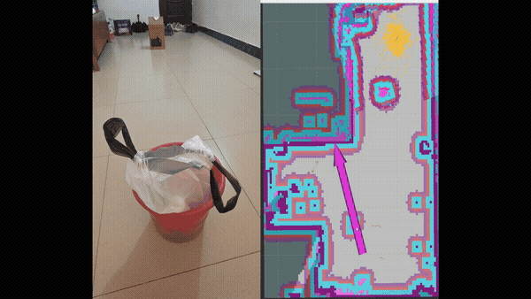

# RK3588/STM32F407 全向底盘自主导航与实时控制系统

## 主要实现

- FreeRTOS 将 100 Hz 速度环、CAN 通信、可选蓝牙遥控和监督诊断拆为独立任务；速度环任务具有最高优先级。
- TIM6 以 1 ms 为基础时基，每 10 ms 通过二值信号量释放一次速度环，控制计算不在中断中执行。
- CAN RX 使用长度为 1 的覆盖队列，只保留最新速度指令，避免总线积压后继续执行过期控制量。
- 四轮控制采用实测前馈 `PWM ≈ 2.296v + 117`、PI、积分限幅与条件抗饱和，并加入编码器低通、目标斜坡和两级同比例限幅。
- 实现 500 ms CAN 指令超时停车、CAN/蓝牙控制权状态机、任务心跳、IWDG、栈余量监控和 CAN 错误诊断。
- ROS 接收端抽干 SocketCAN 缓冲区后只处理最新反馈，并使用 `steady_clock` 计算里程计积分时间。

## 实测结果

- 约 903 Hz CAN 压力输入下，速度环无信号量丢失和截止期违约；最大执行时间与最大唤醒延迟分别为 29 μs 和 13 μs。
- 正式固件的 `0x011` 底盘反馈频率约为 49.98 Hz。
- 0.1 m/s 前进测试中，编码器正运动学速度均值为 0.0987 m/s，RMSE 为 0.00318 m/s。该结果反映轮速控制一致性，不等同于外部定位得到的真实车速误差。
- 横移工况加入编码器低通后，四轮 PWM 标准差下降约 49%～56%。
- 蓝牙 `0x00` 停车后保持手动控制权；收到 `0x05` 后释放到 `IDLE`，CAN 才能重新接管。

## 演示

<p align="center">
  
</p>

## 仓库结构

```text
FreeRTOS/     STM32F407 FreeRTOS 主版本固件
BareMetal/    STM32F407 裸机版本固件
autonav_ws/   ROS Noetic 工作空间
cmake/        GCC 启动文件、链接脚本与公共构建配置
```

## CAN 协议

所有多字节数值均采用小端格式；速度字段使用有符号 `int16_t`，缩放系数为 1000。

| 方向 | CAN ID | 数据 |
|---|---:|---|
| ROS → STM32 | `0x010` | `vx`、`vy`、`wz` 速度指令 |
| STM32 → ROS | `0x011` | 编码器正解 `vx`、`vy`、`wz` 与 IMU `gz` |
| STM32 → 调试工具 | `0x012` | 协议版本、控制模式、故障位、复位原因和 CAN 错误计数 |
| STM32 → 调试工具 | `0x013` | 速度环节拍、截止期及最大执行/唤醒时间 |
| STM32 → 调试工具 | `0x014` | RX 覆盖、TX 邮箱占满和任务最小剩余栈 |
| STM32 → 调试工具 | `0x120～0x123` | 可选的四路电机目标、反馈、PWM 和采样序号 |

`0x010` 超过 500 ms 未更新时，MCU 独立停车并回到 `IDLE`。`0x012～0x014` 是轮换发送的诊断页，不影响只接收 `0x011` 的 ROS 节点。`0x120～0x123` 仅在 `ENABLE_CONTROL_TELEMETRY=1` 时启用，正式导航固件默认关闭。

## 编译 STM32 固件

### CMake + Arm GNU Toolchain

需要 CMake 3.22+、Ninja 和 `arm-none-eabi-gcc`：

```bash
cmake --preset release
cmake --build --preset release
```

产物位于 `build/release/`。

### Keil MDK-ARM

根据需要打开以下工程并执行 Rebuild：

```text
FreeRTOS/chassis.uvprojx
BareMetal/chassis.uvprojx
```

## 运行 ROS

运行环境为 Ubuntu 20.04、ROS Noetic，以及 RK3588 或兼容 Linux 主机。首先将 SocketCAN 接口 `can1` 配置为 500 kbps，然后构建工作空间：

```bash
cd autonav_ws
catkin_make
source devel/setup.bash
roslaunch can1_pkg navigate.launch enable_can_cmd:=true
```

打开导航 RViz 配置：

```bash
roslaunch can1_pkg rviz_navigate.launch
```

`can1_cmd_vel_node` 在 300 ms 内没有收到新的 `/cmd_vel` 时主动发送零速；即使 ROS 节点退出或链路中断，MCU 仍有独立的 500 ms 超时保护。

## 使用说明

- 仓库不包含 RPLIDAR S3 驱动，使用时需安装对应 ROS 驱动并发布 `/scan`。
- 示例地图位于 `autonav_ws/src/2dmaps/`，实车部署时应重新标定底盘、IMU、雷达位姿及导航参数。
- 仓库不提交本地工具链、编译产物、原始测试日志和个人项目笔记。

## 许可证

自编代码采用 [MIT License](LICENSE)。FreeRTOS Kernel 位于 `FreeRTOS/Middlewares/FreeRTOS/`；STM32、ARM 和其他第三方组件遵循各自许可证。
